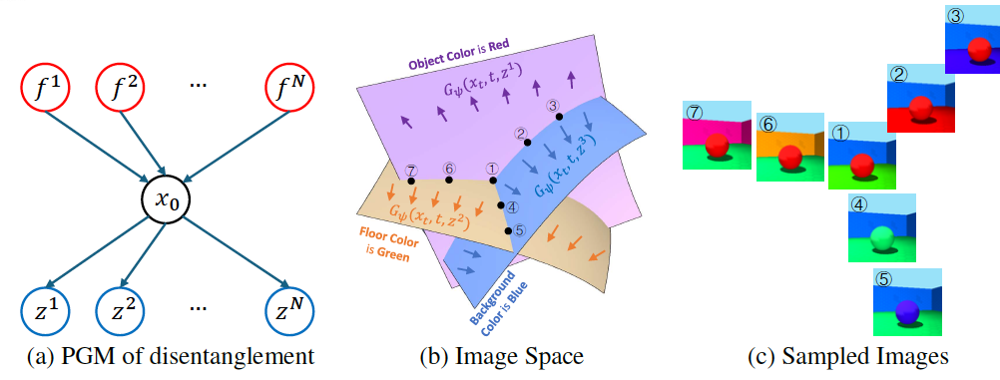
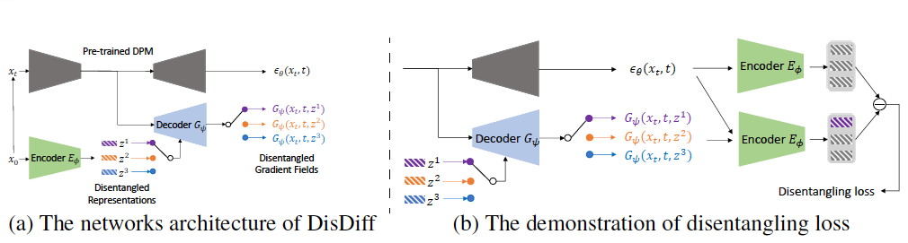

# DisDiff: Unsupervised Disentanglement of Diffusion Probabilistic Models
<a href="https://arxiv.org/abs/2205.10093"></a>
<a href="https://opensource.org/licenses/MIT"></a>

This is the official PyTorch implementation of NeurIPS 2023 paper: DisDiff: Unsupervised Disentanglement of Diffusion Probabilistic Models
[Arxiv](https://arxiv.org/pdf/2301.13721) | [OpenReview](https://openreview.net/forum?id=3ofe0lpwQP)).

> **DisDiff: Unsupervised Disentanglement of Diffusion Probabilistic Models** <br>
> Tao Yang, Yuwang Wang, Yan Lu, Nanning Zheng <br>
> *arXiv preprint arXiv:2102.10303*<br>
> *NeurIPS 2023*<br>

We connect disentangled representation learning to Diffusion Probabilistic Models (DPMs)
to take advantage of the remarkable modeling ability of DPMs. We propose a new task, disentanglement of (DPMs): given a pre-trained DPM, without any
annotations of the factors, the task is to automatically discover the inherent factors
behind the observations and disentangle the gradient fields of DPM into subgradient fields as shown in Figure 1.

<p align="center">
    

    Figure 1: Illustration of disentanglement of DPMs. (a) is the diagram of Probabilistic Graphical Models (PGM). (b) is the diagram of image space. (c) is the demonstration of sampled images in (b). 
</p>


To tackle this task, we devise an unsupervised approach as shown in Figure 2, named DisDiff, achieving disentangled representation learning in the framework of DPMs.

<p align="center">
    

    Figure 2: Illustration of DisDiff. (a) Image x0 is first encoded to representations {z1, z2, . . . zN} by encoder,  (b) We first sample a factor c and decode the representation zc   to obtain the predicted x0. At the same time, we can obtain the predicted x0 of the original pre-trained DPM. We then calculate the disentangling loss based on them.
</p>


## requirements
A suitable conda environment named disdiff can be created and activated with:
```bash
conda env create -f environment.yaml
conda activate disdiff
```
# Usage


```python
from ldm.util import instantiate_from_config
from omegaconf import OmegaConf
cli = OmegaConf.from_dotlist(unknown)
configs = [OmegaConf.load(cfg) for cfg in opt.base]
config = OmegaConf.merge(*configs, cli)

model = instantiate_from_config(config.model)
```
## Datasets
Download datasets for training DisDiff (Shapes3D as an example)

- [Download Shapes3D](https://console.cloud.google.com/storage/browser/3d-shapes)

Manully set "/path/to/your/datasets/" in the following scripts in ldm/data/dis.py, e.g., For Shapes3D. We set the following script for setting dataset path.
```python
class Shapes3DTrain(Shapes3D):
    def __init__(self, **kwargs):
        super().__init__(path='/path/to/your/datasets/',
                original_resolution=None,
                **kwargs)
```
Dataset path structure:

```
/path/to/your/datasets/
├──shapes3d/3dshapes.h5
├──mpi_toy/mpi3d_toy.npz
├──...
```


## Trianing of DisDiff
Similar to LDM, the experiments are conducted by `main.py` script. The models are trained with this script with different configs. Since DisDiff is based on LDM model, we first need to train LDM in the following two stages.

### Train VQVAE/VAE for LDM
`main.py` script conducts the training of LDM, we choose a config file for it to train our VQVAE/VAE. For example, we can choose `configs/autoencoder/{dataset}_vq_4_16.yaml`. A VQVAE/VAE can be trained with the following commend:

```sh
python main.py --base configs/autoencoder/{dataset}_vq_4_16.yaml -t --gpus 0,
```

`dataset` can be {cars3d, shapes3d, mpi3d, celeba}.  As an  example, we can choose `dataset` as shapes3d:

```sh
python main.py --base configs/latent-diffusion/shapes3d-vq-4-16.yaml -t --gpus 0,
```

### Train LDM
`main.py` is the main script to train LDM with pretrained VQVAE/VAE. After the VQ-VAE is trained we set the checkpoint path of the pretrained model as follows: "ckpt_path: /my/vae_checkpoint/path" in each config file, e.g., configs/latent-diffusion/shapes3d-vq-4-16.yaml. We then can train a LDM for the pretrained VQVAE/VAE with the following commend:

```sh
python main.py --base configs/latent-diffusion/{dataset}_vq_4_16.yaml -t --gpus 0,
```

### Trarin DisDiff
`main.py` is also the main script to train DisDiff for a pretrained LDM. After the LDM is trained, we set the checkpoint path of the pretrained models as follows: "ckpt_path: /my/ldm_checkpoint/path" in each config file, e.g., configs/latent-diffusion/shapes3d-vq-4-16-dis.yaml. 

Note that we need to set the ckpt path for two pretrained models. The first is "ckpt_path" in "first_stage_config"; The second is "ckpt_path" in "unet_config". We then can train a LDM for the pretrained VQVAE/VAE with the following commend:
```sh
python main.py --base configs/latent-diffusion/{dataset}-vq-4-16-dis.yaml -t --gpus 0, -dt Z -dw 0.05 -l exp_vq_shapes3d -n {exp-name} -s 0
```
where {exp-name} is the experiment name of this setting. We give an name example "s0", which means random seed is 0.


## Evaluation of DisDiff
`run_para_metrics.py` script conducts the evaluation of DisDiff in paralle. We only need to set the evaluation path by `-l`, the script will load the configerations and ckpts automaticlly. Note that we use `-p` to set the number of the processes.
```sh
python run_para_metrics.py -l exp_vq_shapes3d -p 10
```


# Acknowlegement

Note that this project is built upon [LDM](https://github.com/CompVis/latent-diffusion) and [PDAE](https://github.com/ckczzj/PDAE). The eveluation code is built upon [disentanglement_lib](https://github.com/google-research/disentanglement_lib).

# Citation

```bibtex
@article{Tao2023DisDiff,
  title={DisDiff: Unsupervised Disentanglement of Diffusion Probabilistic Models},
  author={Yang, Tao and Wang, Yuwang and Lu, Yan and Zheng, Nanning},
  journal={NeurIPS},
  year={2023}
}
```